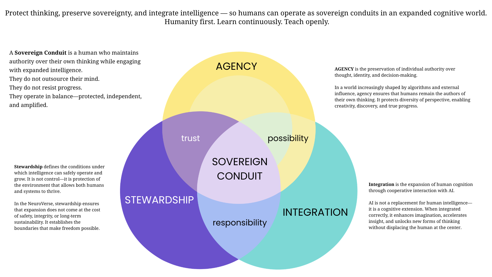

# NeuroVerseOS Worlds

The canonical worldmodel for every NeuroVerseOS repo.
Auto-loaded by [`@neuroverseos/governance`](https://github.com/NeuroverseOS/Neuroverseos-governance) via the org-detect discovery tier — zero per-repo config.

> Protect thinking, preserve agency, and integrate intelligence — so humans can operate as sovereign conduits in an expanded cognitive world.
>
> **Humanity first. Learn continuously. Teach openly.**

---

## 🛡️ Stewardship

Stewardship defines the conditions under which intelligence can safely operate and grow. It is not control — it is protection of the environment that allows both humans and systems to thrive.

In the NeuroVerse, stewardship ensures that expansion does not come at the cost of safety, integrity, or long-term sustainability. It establishes the boundaries that make freedom possible.

## 🌱 Agency

Agency is the preservation of individual authority over thought, identity, and decision-making.

In a world increasingly shaped by algorithms and external influence, agency ensures that humans remain the authors of their own thinking. It protects diversity of perspective, enabling creativity, discovery, and true progress.

## ⚙️ Integration

Integration is the expansion of human cognition through cooperative interaction with AI.

AI is not a replacement for human intelligence — it is a cognitive extension. When integrated correctly, it enhances imagination, accelerates insight, and unlocks new forms of thinking without displacing the human at the center.

---

## Overlap states (center emotions)

### 🛡️ + 🌱 → Trust
Trust emerges when individuals feel safe to think independently and express themselves without pressure or harm.

### 🌱 + ⚙️ → Possibility
Possibility emerges when independent thought is expanded through intelligent systems, enabling new ideas, perspectives, and creative breakthroughs.

### ⚙️ + 🛡️ → Responsibility
Responsibility emerges when powerful tools are used within thoughtful boundaries, ensuring that expansion does not lead to harm.

---

## 🌐 Center identity — The Sovereign Conduit

A Sovereign Conduit is a human who maintains authority over their own thinking while engaging with expanded intelligence.

- They do not outsource their mind.
- They do not resist progress.
- They operate in balance — protected, independent, and amplified.

---

## How this repo works

Any repo whose git remote is under the `NeuroverseOS` GitHub org automatically loads the worldmodels in this directory on the next `radiant` run. No `.neuroverse/config.json` needed, no per-user setup — the discovery engine reads `.git/config`, detects the `NeuroverseOS` owner, and probes this repo.

Change `neuroverseos-sovereign-conduit.worldmodel.md` here → every NeuroverseOS repo sees the update on next run (1h cache, or set `NEUROVERSE_REFRESH=1` to force).

To opt out for a single run: `NEUROVERSE_NO_ORG=1`.
